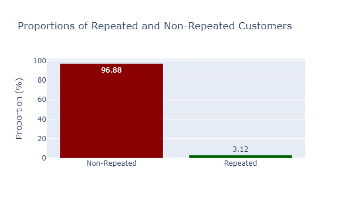
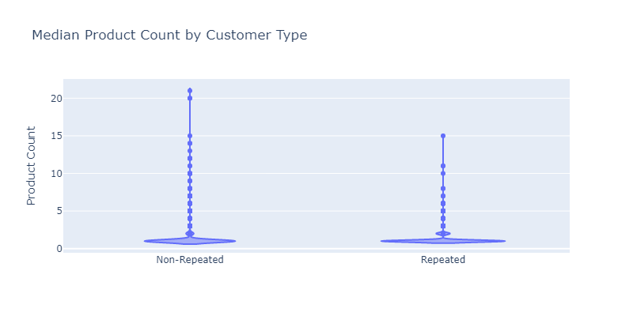
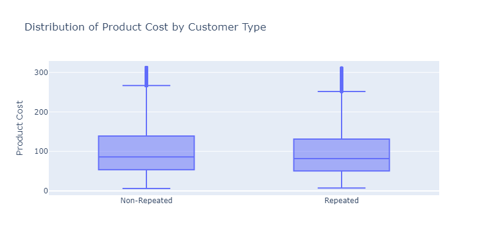
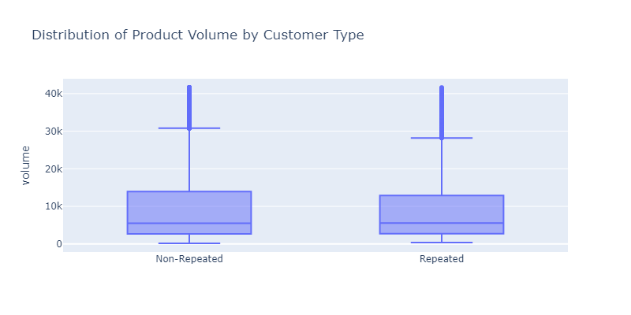
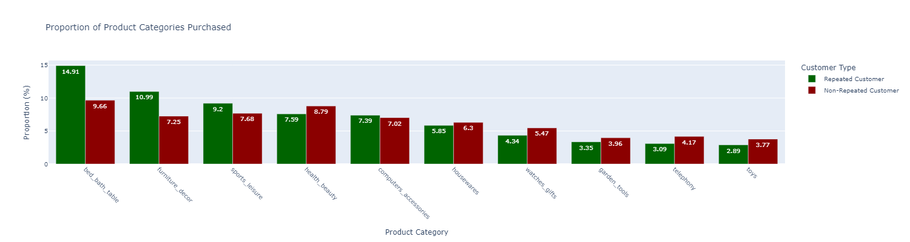
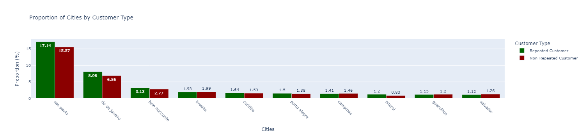
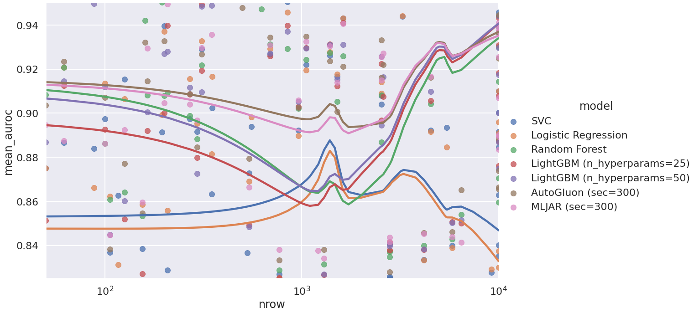

# Associate AI Engineer Technical Test

[](https://kedro.org)

## My Personal Information
Name:   Gawain Yeo-Koh Jin Hng

Email:  gawainyeokoh@gmail.com

## How to Run
```
bash run.sh
```

## Packages
- ipython>=8.10
- jupyterlab>=3.0
- kedro~=0.19.10
- kedro-datasets
- notebook
- pandas
- scikit-learn
- lightbgm
- matplotlib
- seaborn
- plotly
- kaleido
- mpl-tools
- basemap
- imbalanced-learn

## Overview
- data: Folder containing the raw data and intermediate data of the pipelines. Insert raw data in the subfolder 01_raw.
- conf: Contains the configurations used in this assessment. It defines the names of the datasets used in the pipelines as well as parameters.
- src: Contains the codes used for the pipelines in this assignment.
- models: Contains the models developed during model training and optimization.
## Assumption
1) The cities in the customers dataset is the correct spelling and the zip codes, cities and states correctly correspond to one another.
2) Customers who have made more than 1 order on Olist has done so because they are loyal appreciated the service/value Olist provided and not due to other factors, such as sudden sales.
3) Customers who have higher average spending on Olist have greater disposable income.
4) Review scores accurately represent the customers' satisfaction with the order.

# Data Preparation Overview
**Customers**
- Removed apostrophes from the cities to standardize the city names.


**Geolocations**
- Dropped duplicate rows. 98.10% of the rows are duplicate.
- Dropped the entries with erroneous latitude and longitude i.e. latitudes and longitudes that exist outside of Brazil. There are 42 entries with erroneous lat and lng values.
- Aggregated the latitude and longitude data of the geolocations dataset by zip code.
- Standardized the spellings of the cities, converting diacritics to standard alphabet as diacritics are used.
- Corrected encoding or other errors in the city names by cross-referencing with the customers dataset. There are erroneous characters such as superscripts and symbols.

**Products**
- Dropped rows of products with almost completely missing information of the product i.e. rows with null in all columns except product_id. These rows do not provide information of products and thus should be dropped. 2 rows have no information of the product exccept for the product id.
- Imputed missing entries in the products dataset using iterative imputing as they are only a small proportion of the dataset. Imputing them fills in the NaN values and ensures the other fields can be used. 1.85% of the entries have at least 1 null value. These can be imputed.

**Orders**
- Dropped the order_approved_at and order_delivered_carrier_date fields as they are not useful for determining if the customers will make repeat purchases.
- Dropped the erroneous orders which are declared delivered but do not have a date. There are 2 occurences.

**Reviews**
- Dropped the fields 'review_comment_title' and 'review_comment_message' fields as they contain a significant proportion of missing values (88.34% and 58.70% respectively).

**Payments**
- Dropped payment sequential column as its not a feature that is not relevant to the customers' making repeat purchases from Olist.

**Sellers**
- Standardized the spellings of the cities, converting diacritics to standard alphabet as diacritics are used.
- Corrected encoding or other errors in the city names by cross-referencing with the customers dataset.

**Translations and Items**
- Do not require cleaning.

# Exploratory Data Analysis

## Returning Customer Rate


**Findings**:
- Only 2997 of the 96096 customers from 2016 to 2018, are repeated customers. 
- This is only about 3.12% of the total customers from 2016 to 2018.

**Impacts**:
- This proportion is very small and the insights obtained of repeated customers may be prone to noise.
- The disproportionate sample sizes of repeat and non-repeat customers may make training a model difficult. Techniques to mitigate the impacts of the imbalanced classes of repeat and non-repeat customers. 

## Delivery Efficiency


**Delivery Offset* refers to how early or late the delivery is based on the estimated delivery time. Negative delivery offsets are early deliveries, and positive delivery offsets are late deliverys.

This feature is created by calculating the days between actual delivery arrival date and the estimated delivery arrival date.

Investigates if the timeliness of Olist's delivery service affects customer making repeat purchases.

**Findings**:
- Both repeated and non-repeated customers have similar distributions of delivery offsets.
- This suggests that the delivery offset, which indicates how early or late a delivery is, does not significantly influence a customer's likelihood of making a repeat purchase on Olist.
- Surprisingly, this means the efficiency of Olist's delivery process is not a factor that contributes to customers making repeated purchases on Olist.

Hence, this feature will not be used in modelling.


## Product Pricing


Investigates if repeat customers prefer to use Olist to buy cheaper or more expensive products.

**Findings**:
- Both products purchased by repeated and non-repeated customers have similar distributions.
- This implies that the price and payments of the products do not influence repeated customers to make repeated purchases in Olist.

Hence, payments and price related features will not be used for modelling.

**Findings**:
- The distributions of product description length for both repeat and non-repeated customers are similar.
- This implies that the length of the description does not impact repeated customers from making repeat purchases.
- It also suggests that the tags or other text information of the product is not important when customers decide if they should make a repeat purchase from Olist.

This feature will not be used as description lenght likely will not 

## Product Volume


Investigates if the size of the product influences customers making repeat purchases.

**Findings**:
  - The volume of the product does not influence repeated customers from making repeat purchases.
  - However, the volume of the product, individually, may not be complete enough to determine if the product's size influences customers making repeat purchases as there is also the factor of product weight.

The dimensions of the product will be kept as there may be a relationship between the volume and weight of the product in influencing customers repeat purchases.


## Product Category


Investigates if the category of the product influences customers making repeat purchases.

**Findings**:
- Repeated customers buy 5% more products from the bed_bath_table and  3% more products from the furniture_decor category in Olist, as compared to non-repeated customers.
- This implies that Repeated Customers favour Olist for providing products related to:
  - bed_bath_table
  -  furniture_decor

This feature will likely be useful for the modeling process and included in feature selection.


## Location


**Findings**:
- The bar chart above shows that the distribution of cities in the geolocations dataset is generally even for both repeated and non-repeated customers.
- The even distribution suggests that residents living in different most cities do not have a preference or significant difference in their likelihood to make repeat purchases with Olist.
- However, notably, there is a slightly higher proportion of repeat customers residing in sao paulo and rio de janerio as compared to non-repeat customers (1%).
- This could suggest that sao paulo and rio de janerio residents have a higher demand for products offered by Olist, making them more likely to return and make repeat purchases.
- It could also suggest that sao paulo and rio de janerio residents are more likely to appreciate Olist's services over other ecommerce websites.
- To increase Returning Customer Rate and loyalty to Olist, Olist can increase marketing efforts in the cities of sao paulo and rio de janeiro

# Feature Engineering

## Product Volume
Multiplied the dimensions of the product to get its volume. 

It was created as it reduces the dimensions of the dataset while still capturing the size of the product.

## Delivery Duration
Refers to the time it took for the order to be delivered to the customer after having purchased it on Olist.

It was created as the time taken for the product to be delivered may have an impact on customers making repeat orders. Described in Feature Selection.

# Feature Selection

## customer_city
In the EDA, specific cities such as sao paulo and rio de janeiro are related with repeat customer purchases. Hence, it will be selected.

## review_score
While the EDA suggests that it does not affect customers making repeat purchases, it may have a relationship with the other features of the products they purchased. Hence, it will be kept.

## median_product_weight_g and product_volume
The information of the product, individually, will likely not influence customers to make repeat purchases. But by training a model with the information of the product, complex relationships between product information may be used to determine the type of product that is more likely to be repurchased by customers.

## mode_product_category_name
The bed_bath_table category was determined to be a category of products that repeated customers are more likely to buy than non-repeated customers. Hence, to capture this relationship, it was selected.

## Delivery Duration
Customers may be more interested in Olist delivering products as early as possible as compared to being on-time. This feature will capture that and use it for model training. Customers may be more likely to make repeat purchases if they believe they can obtain early delivieries rather than timely deliveries. Hence, this feature was engineered and selected.


# Modelling



I referenced this benchmark to identify ideal machine learning models for this modelling process: https://www.data-cowboys.com/blog/which-machine-learning-classifiers-are-best-for-small-datasets

### Random Forest
Pros:
- Robust to overfitting
- Performs well with small datasets (2nd highest mean AUROC in the benchmark above with fewer samples/nrows)

Cons:
- May be sensitive to noise

### LightBGM
Pros:
- Fast training speeds (allows for comprehensive hyperparameter tuning)
- Generalises well with small datasets (3nd highest mean AUROC in the benchmark above with fewer samples/nrows)

Cons:
- Tendency to overfit

### Logistic Regression
Pros:
- Fast training speeds
- Threshold can be adjusted easily in tuning.
Cons:
- Poor at capturing non-linear relationships
- Limited performance

# Training
The models were trained with recall as the primary metric as we needed to focus on training models that can accurately predict repeated customers due to the imbalanced dataset. Recall is the proportion of repeat customers that were accurately predicted correct.

# Optimization
## Grid Search
Using grid search, I also identified optimized the models, achieving these benchmarks.
| Model                  | Accuracy | F1 Score | Precision | Recall  |
|------------------------|----------|----------|-----------|---------|
| Unoptimized RF         | 0.936179 | 0.507616 | 0.673089  | 0.511567 |
| Optimized RF           | 0.936910 | 0.483714 | 0.468455  | 0.500000 |
| Unoptimized LightBGM   | 0.937640 | 0.496140 | 0.937570  | 0.506176 |
| Optimized LightBGM     | 0.937692 | 0.499328 | 0.881957  | 0.507746 |
| Unoptimized LR         | 0.936910 | 0.483714 | 0.468455  | 0.500000 |
| Optimized LR           | 0.936910 | 0.483714 | 0.468455  | 0.500000 |

Generally, the results did not improve substantially. This is due to the imbalanced dataset. The model overfitted to the non-repeated customers. Optimizations were not able to make improvements because of the imbalance.

Notably, the optimized LightBGM was the only one able to improve its recall after optimization.

It was optimized in 4 parameters:
| Parameter       | Unoptimized | Optimized |
|-----------------|-------------|-----------|
| **max_depth**   | -1          | 16         |
| **n_estimators**| 100         | 300       |
| **max_bin**  | 31          | 127        |
| **reg_lambda**  | 0.0         | 1        |


## Random Under Sampler

| Model          | Accuracy | F1 Score | Precision | Recall   |
|----------------|----------|----------|-----------|----------|
| RUS RF         | 0.493138 | 0.385896 | 0.509773  | 0.541274 |
| RF             | 0.936910 | 0.483714 | 0.468455  | 0.500000 |
| RUS LightBGM   | 0.562490 | 0.424442 | 0.516505  | 0.569028 |
| LightBGM       | 0.937692 | 0.499328 | 0.881957  | 0.507746 |
| RUS LR         | 0.499713 | 0.384803 | 0.503840  | 0.516240 |
| LR             | 0.936910 | 0.483714 | 0.468455  | 0.500000 |

To mitigate the impacts of the imbalanced dataset, another way I optimized my model is by using Random Undersampler. Because of the imbalanced dataset, using RUS ensures that the model is trained on a balanced subset of the data, which helps mitigate the bias towards the non-repeated customer class. This improved the recall for all the 3 models, particularly LightBGM, which had its recall increased by 6%. All models are using their most optimal parameters identified.
